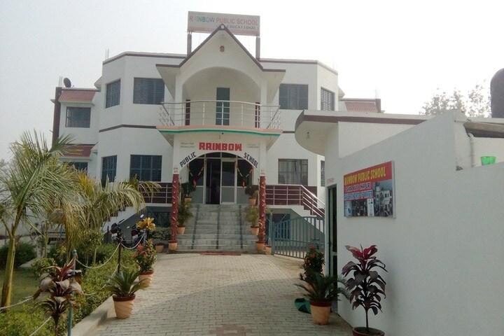

<!DOCTYPE html>
<html lang="en">
<head>
    <meta charset="UTF-8">
    <meta http-equiv="X-UA-Compatible" content="IE=edge">
    <meta name="viewport" content="width=device-width, initial-scale=1.0">
    <meta name="keywords" content="jai kumar, portfolio, jai, linux administrator, personal portfolio lifecodes, portfolio design, portfolio website, personal portfolio" />
    <meta name="description" content="Welcome to Jai's Portfolio. Linux Administrator, Cloud Architect, CCNA" />
    <!-- Custom CSS -->
    <link rel="stylesheet" href="./assets/css/style.css">
    <!-- Font Awesome -->
    <link rel="stylesheet" href="https://cdnjs.cloudflare.com/ajax/libs/font-awesome/5.15.3/css/all.min.css" integrity="sha512-iBBXm8fW90+nuLcSKlbmrPcLa0OT92xO1BIsZ+ywDWZCvqsWgccV3gFoRBv0z+8dLJgyAHIhR35VZc2oM/gI1w==" crossorigin="anonymous" referrerpolicy="no-referrer" />
    <!-- Favicon -->
    <link id='favicon' rel="shortcut icon" href="./assets/images/favicon.png" type="image/x-png">
    <title>Portfolio | JAI KUMAR</title>
</head>
<body oncontextmenu="return false">

<!-- pre loader -->
<!-- 

  

 -->

<!-- navbar starts -->
<header>
        <a href="/" class="logo"><i class="fab fa-node-js"></i> JAI KUMAR </a>

        

        <nav class="navbar">
            <ul>
            <li><a class="active" href="#home">Home</a></li>
            <li><a href="#about">About</a></li>
            <li><a href="#skills">Skills</a></li>
            <li><a href="#education">Education</a></li>
            <li><a href="#work">Work</a></li>
            <li><a href="#experience">Experience</a></li>
            <li><a href="#contact">Contact</a></li>
            </ul>
        </nav>
</header>
<!-- navbar ends -->

<!-- hero section starts -->
<section class="home" id="home">
    

    

    <h2>Hi There,  I'm JAI Kumar</h2>
    
i am into 

    <a href="#about" class="btn">About Me
      <i class="fas fa-arrow-circle-down"></i>
    </a>
    

        <ul class="social-icons">
          <li><a class="linkedin" aria-label="LinkedIn" href="https://www.linkedin.com/in/jai-kumar-663938316/" target="_blank"><i class="fab fa-linkedin"></i></a></li> 
          <li><a class="github" aria-label="GitHub" href="https://github.com/thakurjaitomar" target="_blank"><i class="fab fa-github"></i></a></li>
          <li><a class="twitter" aria-label="Twitter" href="https://www.instagram.com/aslicecode" target="_blank"><i class="fab fa-twitter"></i></a></li>
          <li><a class="telegram" aria-label="Telegram" href="http://t.me/thakurjaitomar" target="_blank"><i class="fab fa-telegram-plane"></i></a></li>
          <li><a class="instagram" aria-label="Instagram" href="https://www.instagram.com/thakurjaitomar?igsh=MXc2OHcwdGpreHZ1dQ=="><i class="fab fa-instagram" target="_blank"></i></a></li>
          <li></li>
        </ul>
      

    

    

</section>
<!-- hero section ends -->

<!-- about section starts -->
<section class="about" id="about">
    <h2 class="heading"><i class="fas fa-user-alt"></i> About Me</h2>
    
    

    

        
    

    

        <h3>I'm JAI KUMAR</h3>
        Linux Administrator | Cloud Architect | CCNA 
        
        
I am deeply grateful for the opportunity to pursue my passion as a Linux Administrator and Cloud Architect, 
working extensively with AWS, Azure, and DevOps technologies. Every challenge
 I face strengthens my resolve to grow and refine my skills in these fields.
 Being a CCNA-certified professional has opened doors for 
me to explore the vast world of networking and cloud infrastructure. 

        
        

            <!-- 

              
 age:  20

              
 phone :  +91 975-901-8670

            
 -->
            

              
 email :  thakurjaitomar@gmail.com

              
 place :  Shalimar Bagh, New Delhi, India - 110088

            

        

        
        

            <a href="https://drive.google.com/file/d/18rwwg842IEvfLaqHHSiPMi66oraJj0uD/view" target="_blank" class="btn">Resume
                <i class="fas fa-chevron-right"></i>
            </a>
        

    

    

</section>
<!-- about section ends -->

<!-- skills section starts -->
<section class="skills" id="skills">

    <h2 class="heading"><i class="fas fa-laptop-code"></i> Skills & Abilities</h2>

    

        <!-- Linux Administration Section -->
        

            <h3>➡ Linux Administration:</h3>
            <ul>
                <li>Proficient in managing Linux servers (Ubuntu, CentOS, RedHat).</li>
                <li>Expertise in shell scripting, user management, and system security.</li>
                <li>Experience in configuring and troubleshooting network services like DNS, DHCP, FTP, and Apache.</li>
                <li>Strong understanding of file systems, package management, and kernel tuning.</li>
            </ul>
        

        <!-- Azure Administration Section -->
        

            <h3>➡ Azure Administration:</h3>
            <ul>
                <li>Managing Azure virtual machines, storage accounts, and networks.</li>
                <li>Implementing Azure AD, security controls, and monitoring.</li>
                <li>Expertise in Azure Resource Manager (ARM) templates and Azure DevOps.</li>
                <li>Knowledge of cost management, scaling, and load balancing in Azure environments.</li>
            </ul>
        

        <!-- AWS Administration Section -->
        

            <h3>➡ AWS Administration:</h3>
            <ul>
                <li>Deep understanding of AWS services like EC2, S3, RDS, VPC, and IAM.</li>
                <li>Hands-on experience with CloudFormation, Elastic Beanstalk, and Auto Scaling.</li>
                <li>Monitoring and managing workloads with CloudWatch, CloudTrail, and AWS Config.</li>
                <li>Skilled in implementing security best practices using AWS KMS, WAF, and GuardDuty.</li>
            </ul>
        

        <!-- DevOps (AWS & Azure) Section -->
        

            <h3>➡ DevOps (AWS & Azure):</h3>
            <ul>
                <li>Proficient in CI/CD pipelines using Jenkins, GitLab CI, and Azure Pipelines.</li>
                <li>Hands-on with Infrastructure as Code (IaC) tools like Terraform and Ansible.</li>
                <li>Experience in containerization using Docker and orchestration with Kubernetes.</li>
                <li>Expertise in version control (Git), configuration management, and automation.</li>
            </ul>
        

       <!-- CCNA Section -->

    <h3>➡ CCNA (Cisco Certified Network Associate):</h3>
    <ul>
        <li>Strong understanding of networking protocols (TCP/IP, OSPF, EIGRP, BGP).</li>
        <li>Skilled in configuring and troubleshooting Cisco routers and switches.</li>
        <li>Experience with network security, VLANs, and access control lists (ACLs).</li>
        <li>Knowledge of WAN technologies, IPv6, and network addressing/subnetting.</li>
    </ul>

    

</section>
<!-- skills section ends -->

<!-- education section starts -->
<section class="education" id="education">

  <h1 class="heading"><i class="fas fa-graduation-cap"></i> My Education</h1>

    
Education is not the learning of facts, but the training of the mind to think.

    

    

        

        
        

        

        <h3>Bachelor of Computer Applications</h3>
        
Subharti University | Meerut | Uttar Pradesh 

        <h4>2024-2027 | Pursuing</h4>
        

    

    

      

      
      

      

      <h3>Secondary Education</h3>
      
Rainbow Public School - Hapur - 245205 | CBSE

      <h4>2023-2024 | Completed</h4>
      

    

</section>
<!-- education section ends -->

<!-- work project section starts -->
<section class="work" id="work">

  <h2 class="heading"><i class="fas fa-laptop-code"></i> Projects Made</h2>

  

    

      
      

        

          <h3>SSH Configuration</h3>
        

        

          
Configuring SSH for Secure Remote Access

          
How to Configure SSH: A Complete Guide

          
Setting Up SSH: Step-by-Step Configuration

          <pSSH Configuration for Secure Remote Connections

          

            <a href="#" class="btn" target="_blank"><i class="fas fa-eye"></i> View</a>
            <a href="https://github.com/jigar-sable/Portfolio-Website" class="btn" target="_blank">Code <i class="fas fa-code"></i></a>
          

          <!-- Add link for PDF download below the buttons -->
          

            <a href="path-to-your-pdf/portfolio-website.pdf" class="btn" target="_blank">
              <i class="fas fa-file-pdf"></i> Download PDF
            </a>
          

        

      

    

    

      
      

        

          <h3>Project 2</h3>
        

        

          
Description of Project 2. This is a brief overview of what the project entails.

          

            <a href="#" class="btn" target="_blank"><i class="fas fa-eye"></i> View</a>
            <a href="https://github.com/your-github-link-to-project-2" class="btn" target="_blank">Code <i class="fas fa-code"></i></a>
          

          <!-- Add link for PDF download below the buttons -->
          

            <a href="path-to-your-pdf/project2.pdf" class="btn" target="_blank">
              <i class="fas fa-file-pdf"></i> Download PDF
            </a>
          

        

      

    

    <!-- Repeat similar structure for other projects -->
    
  

  

    <a href="/projects" class="btn">View All <i class="fas fa-arrow-right"></i></a>
  

</section>
<!-- work project section ends -->

<!-- experience section starts -->
<section class="experience" id="experience">

  <h2 class="heading"><i class="fas fa-briefcase"></i> Experience </h2>

  

    

      

        

          <h2>Linux Administrator</h2>
        

        

            <h3>Ducat Institute, New Delhi</h3>
            
IT Institue | 2024

        

      

    

    

      

        

          <h2>Cloud Architect</h2>
        

        

            <h3>Azue | AWS | DevOps</h3>
            
Ducat Institute, New Delhi

        

      

    

    

      

        

          <h2>CCNA Cisco Certified</h2>
        

        

            <h3>Ducat Institute, New Delhi</h3>
            
IT Institute - 2024

        

      

    

  

    <a href="/experience" class="btn">View All
      <i class="fas fa-arrow-right"></i>
  </a>
  

</section>
<!-- experience section ends -->

<!-- contact section starts -->
<section class="contact" id="contact">

  <h2 class="heading"><i class="fas fa-headset"></i> Get in Touch</h2>

  

    

      

        
      

      <form id="contact-form" action="https://formspree.io/f/xrbznlkk" method="POST">
        

          

            <input type="text" name="name" placeholder="Name" required>
            <i class='fas fa-user'></i>
          

          

            <input type="email" name="email" placeholder="Email" required>
            <i class='fas fa-envelope'></i>
          

          

            <input type="tel" name="phone" placeholder="Phone">
            <i class='fas fa-phone-alt'></i>
          

          

            <textarea placeholder="Message" name="message" required></textarea>
            <i class="fas fa-comment-dots"></i>
          

        

        

          <button type="submit">
            Submit <i class="fa fa-paper-plane"></i>
          </button>
        

      </form>
    

  

</section>
<!-- contact section ends -->

<!-- footer section starts -->
<section class="footer">

  

      

          <h3>Jai's Portfolio</h3>
          
Thank you for visiting my personal portfolio website. Connect with me over socials.     Keep Rising 🚀. Connect with me over live chat!

      

      

          <h3>quick links</h3>
          <a href="#home"><i class="fas fa-chevron-circle-right"></i> home</a>
          <a href="#about"><i class="fas fa-chevron-circle-right"></i> about</a>
          <a href="#skills"><i class="fas fa-chevron-circle-right"></i> skills</a>
          <a href="#education"><i class="fas fa-chevron-circle-right"></i> education</a>
          <a href="#work"><i class="fas fa-chevron-circle-right"></i> work</a>
          <a href="#experience"><i class="fas fa-chevron-circle-right"></i> experience</a>
      

      

          <h3>contact info</h3>
          
 <i class="fas fa-phone"></i>+91 975-901-8670

          
 <i class="fas fa-envelope"></i>thakurjaitomar@gmail.com

          
 <i class="fas fa-map-marked-alt"></i>New Delhi, India - 110088

          

              
              
              
              <a class="instagram" aria-label="Instagram" href="https://www.instagram.com/thakurjaitomar?igsh=MXc2OHcwdGpreHZ1dQ=="><i class="fab fa-instagram" target="_blank"></i></a>
              
          

      

  

  <h1 class="credit">Designed with <i class="fa fa-heart pulse"></i> by <a href="https://www.linkedin.com/in/jai-kumar-663938316/"> JAI KUMAR</a></h1>

</section>
<!-- footer section ends -->

<!-- scroll top btn -->

<!-- scroll back to top -->

<!-- ==== ALL MAJOR JAVASCRIPT CDNS STARTS ==== -->
<!-- jquery cdn -->

<!-- typed.js cdn -->

<!-- particle.js links -->

<!-- vanilla tilt.js links -->

<!-- scroll reveal anim -->

<!-- ==== ALL MAJOR JAVASCRIPT CDNS ENDS ==== -->

</body>
</html>
# My_portfolio_
# jai_portfolio
# my_portfolio
